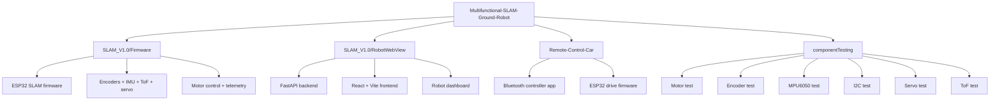

# Multifunctional SLAM Ground Robot

This repository is the top-level workspace for a modular ground-robot project built around an ESP32 controller, SLAM-capable firmware, and two companion user interfaces:

- autonomous SLAM and navigation firmware for the robot chassis
- a browser-based robot dashboard for monitoring and control
- a Bluetooth remote-control app for manual driving
- standalone PlatformIO sketches for validating individual hardware components

The repo is organized as a meta-project with Git submodules and test sketches, so this README focuses on the overall system layout and the quickest way to get oriented.

## What lives where

| Path                                             | Purpose                                                                                |
| ------------------------------------------------ | -------------------------------------------------------------------------------------- |
| [SLAM_V1.0/Firmware](SLAM_V1.0/Firmware)         | Main ESP32 SLAM firmware, sensor fusion, motor control, and telemetry                  |
| [SLAM_V1.0/RobotWebView](SLAM_V1.0/RobotWebView) | FastAPI + WebSocket backend with a React/Vite dashboard                                |
| [Remote-Control-Car](Remote-Control-Car)         | Bluetooth joystick controller app plus ESP32 drive firmware                            |
| [componentTesting](componentTesting)             | Isolated PlatformIO projects for encoder, I2C, motor, MPU6050, servo, and ToF bring-up |

## System Overview

The project is split into two robot-control paths:

1. The SLAM stack uses the ESP32 firmware in [SLAM_V1.0/Firmware](SLAM_V1.0/Firmware) to read encoders, IMU, and ToF data, then fuses it into pose and scan data for autonomous movement.
2. The manual-drive stack uses the Bluetooth controller in [Remote-Control-Car](Remote-Control-Car) to send joystick commands to a separate ESP32 drive firmware.



## Hardware Summary

The robot platform centers on an ESP32 development board and the following hardware:

- two DC motors driven through an L298N-style motor driver
- two wheel encoders for odometry
- an MPU6050 IMU for heading and motion sensing
- a servo-mounted ToF scanner for obstacle detection and mapping
- shared I2C peripherals on the same bus

The firmware documentation in [SLAM_V1.0/Firmware/docs/pin-mapping.md](SLAM_V1.0/Firmware/docs/pin-mapping.md) and [SLAM_V1.0/Firmware/docs/architecture.md](SLAM_V1.0/Firmware/docs/architecture.md) contains the more detailed electrical and control-loop notes.

## SLAM Firmware

The main SLAM firmware lives in [SLAM_V1.0/Firmware](SLAM_V1.0/Firmware).

Key behaviors:

- reads wheel encoders, MPU6050 data, and VL53L0X ToF measurements
- runs a non-blocking control loop for pose estimation and scanning
- streams telemetry to the host computer over serial
- accepts host commands and transitions through INIT, STANDBY, DRIVING, and SAFE_STOP states

Relevant docs:

- [Architecture overview](SLAM_V1.0/Firmware/docs/architecture.md)
- [Communication protocol](SLAM_V1.0/Firmware/docs/comms-protocol.md)
- [Pin mapping](SLAM_V1.0/Firmware/docs/pin-mapping.md)
- [SLAM notes](SLAM_V1.0/Firmware/docs/slam-notes.md)

### Firmware build

```bash
cd SLAM_V1.0/Firmware
pio run
pio run -t upload
pio device monitor
```

The PlatformIO environment is configured in [SLAM_V1.0/Firmware/platformio.ini](SLAM_V1.0/Firmware/platformio.ini).

## Robot Dashboard

The dashboard stack lives in [SLAM_V1.0/RobotWebView](SLAM_V1.0/RobotWebView).

It includes:

- a FastAPI backend with WebSocket streaming
- a React + Vite frontend for robot status and control
- helper scripts for running the full stack from one command

The project README in [SLAM_V1.0/RobotWebView/README.md](SLAM_V1.0/RobotWebView/README.md) already documents setup and launch options, so the short version here is:

```bash
cd SLAM_V1.0/RobotWebView
make setup
make dev
```

If you prefer separate services, run the backend and frontend independently using the commands in that README.

## Bluetooth Remote Control

The manual-drive app lives in [Remote-Control-Car](Remote-Control-Car).

It contains:

- a mobile-friendly React/Capacitor UI with joystick and emergency stop controls
- a Bluetooth Serial command stream using the `J:x,y` joystick packet format
- matching ESP32 drive firmware under [Remote-Control-Car/firmware](Remote-Control-Car/firmware)

The communication details are described in [Remote-Control-Car/docs/ble-protocol.md](Remote-Control-Car/docs/ble-protocol.md), and the wiring notes are in [Remote-Control-Car/docs/pin-mapping.md](Remote-Control-Car/docs/pin-mapping.md).

### App build and run

```bash
cd Remote-Control-Car/app
npm install
npm run dev
```

### Drive firmware build

```bash
cd Remote-Control-Car/firmware
pio run
pio run -t upload
pio device monitor
```

## Component Testing Projects

The [componentTesting](componentTesting) folder contains one PlatformIO project per subsystem:

- [encoder.test](componentTesting/encoder.test)
- [I2C.test](componentTesting/I2C.test)
- [motor.test](componentTesting/motor.test)
- [mpu6050.test](componentTesting/mpu6050.test)
- [servo.test](componentTesting/servo.test)
- [tof.test](componentTesting/tof.test)

Use these sketches when validating a single piece of hardware before integrating it into the full SLAM firmware. Each folder is its own PlatformIO project, so you can open it directly in PlatformIO or run the same `pio run` / `pio device monitor` workflow from inside that folder.

## Clone And Update

Because this workspace uses submodules, clone it with submodule recursion enabled:

```bash
git clone --recurse-submodules https://github.com/KavinduMethpura/Multifunctional-SLAM-Ground-Robot.git
```

If the repository was already cloned without submodules, initialize them afterward:

```bash
git submodule init
git submodule update
```

To pull the latest upstream state for a specific linked project:

```bash
git submodule update --remote SLAM_V1.0/Firmware
git submodule update --remote SLAM_V1.0/RobotWebView
git submodule update --remote Remote-Control-Car
```

## Practical Notes

- Keep the ESP32, motor driver, and battery grounds tied together.
- Verify encoder pull-ups and I2C wiring before assuming firmware faults.
- If the SLAM stack stalls under motor load, check motor noise, wiring length, and the I2C recovery behavior documented in the firmware notes.
- Use the component test projects before combining multiple sensors in one build.

## Repository Status

This repository is actively used as a development workspace rather than a polished release package, so some subproject READMEs are intentionally minimal. The top-level README is the best place to start when you want the full system map.
